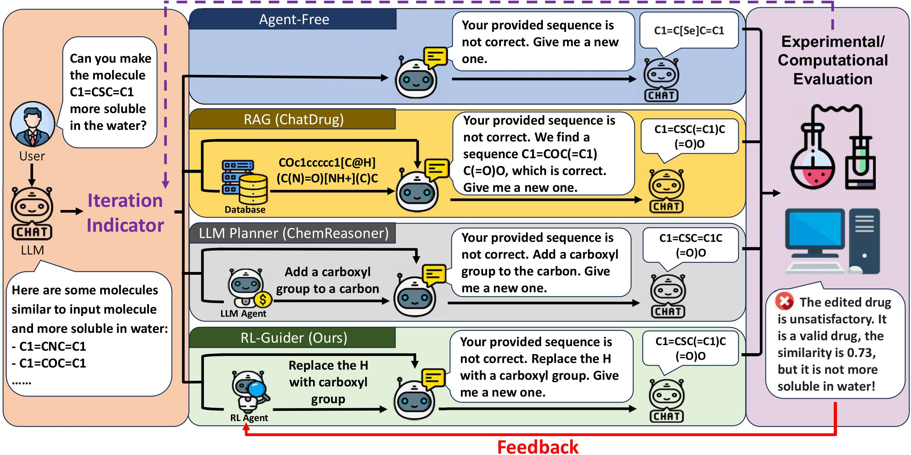

<div align="center">

# RL-Guider: Leveraging Historical Decisions and Feedback for Drug Editing with Large Language Models 

<p align="center">

  <a href="https://aclanthology.org/2025.findings-acl.680/">
    
  </a>
</p>
</div>


<div align="center">


**RL_Guider Framework**
</div>

# 

# 📰 News
- 2025.04 Our paper has been accepted by ACL 2025 Findings!

# ✒️ Abstract
Recent success of large language models (LLMs) in diverse domains showcases their potential to revolutionize scientific fields, including drug editing. Traditional drug editing relies on iterative conversations with domain experts, refining the drug until the desired property is achieved. This interactive and iterative process mirrors the strengths of LLMs, making them well-suited for drug editing. *In existing works, LLMs edit each molecule independently without leveraging knowledge from past edits.* However, human experts develop intuition about effective modifications over time through historical experience; accumulating past knowledge is pivotal for human experts, and so it is for LLMs. *In this work, we propose RL-Guider — a reinforcement-learning agent to provide suggestions to LLMs; it uses the rich information provided from evaluating editing results made by the LLM based on the recommendations to improve itself over time.* RL-Guider is the first work that leverages both the comprehensive “world-level” knowledge of LLMs and the knowledge accumulated from historical feedback. As a result, RL-Guider mitigates several shortcomings of existing approaches and demonstrates superior performance. 

# 🚀 Running Experiments

## Installation
It is recommended to use Conda to manage the environment.
```bash
conda create -n rl-guider python=3.10
conda activate rl-guider
pip install -r requirements.txt
```

## Data Preparation
- For small molecule editing, data can be found in: 'Data/small_molecule/small_molecule_editing.txt'. Credit to [MoleculeSTM paper](https://arxiv.org/abs/2212.10789).

## Module Preparation
- For small molecule editing, no extra module need to prepare.
- Script below will help you prepare module for peptide & protein editing.
```bash
cd ./rl-guider
python download.py

mhcflurry-downloads fetch models_class1_presentation
mv mhcflurry-downloads path models_class1_presentation /Data/peptide/models_class1_presentation
```
- Download Embedding Model
```bash
# Embedding model will be automatedly downloaded via huggingface, if encounter network issue please use the following command:
export HF_ENDPOINT=https://hf-mirror.com
```

## API Key
Configure your API key in `src/llm/deepseek_interface.py`, please note that the client is supported by tencent cloud platform:
```python
API_KEY = "YOUR-API-KEY"
```

## Running
The codebase execution is divided into three main steps:

### 1. Gather Drug Editing Buffer
This step gather necessary drug editing experience by assigning LLM editing agent with pre-defined action.

```bash
python gather_buffer_smiles.py --num_of_episode=1 # num_of_episode: number of episode for each pre-defined action.
```

### 2. Process Buffer with Embedding Model
This step process buffer gathered previously by embedding smiles string to vector representation and saved them in a '.pth' file for fast off-line reinforcement training.
```bash
# Assuming config num_of_episode=1 previously:
python process_buffer_smiles.py --replay_buffer_name='general_replay_buffer_mol_epi_1'
```

### 3. Train RL-Guider for Suggestion Generation
Now you can train a light-weight guidance model for providing valuable drug editing suggestion based on a given smiles string.
```bash
# Training RL-Guider for Task 101 Strict (More Soluble in Water & Threshold=0.5):
python train_rl_smiles.py --task_id=101 --replay_buffer_name='general_replay_buffer_mol_epi_1' --constraint='strict' --reward_type='add' --a=1 --b=1 --c=0 --tau=0.01 
```
All the generated result will be saved in the folder 'results'.

### 4. Run Drug Editing with RL-Guider
Everything is ready! You can use trained RL-Guider to provide suggestion for specified LLM to conduct drug editing procedure. 
```bash
python run_planner_tree.py --conversational_LLM='deepseek' --depth=3 --num_generate=1 --num_keep=1 --num_of_mol=200 --task_id=101 --planner='baseline' --constraint='strict' --conversation_type='single'
```
You can check 'log' for detailed editing recording.

# 🌟 Citation

If you find this work helpful, please cite our paper:

```latex
@inproceedings{liu-etal-2025-rl,
    title = "{RL}-Guider: Leveraging Historical Decisions and Feedback for Drug Editing with Large Language Models",
    author = "Liu, Xufeng  and Ding, Yixuan  and Qu, Jingxiang  and Zhang, Yichi  and Gao, Wenhan  and Liu, Yi",
    booktitle  = "Findings of the Association for Computational Linguistics: ACL 2025",
    year = "2025",
}
```

# 📩 Contact

If you have any questions or want to use the code, feel free to contact:
Yixuan (yixuan0248@gmail.com)

Thanks for your interest in our work!
